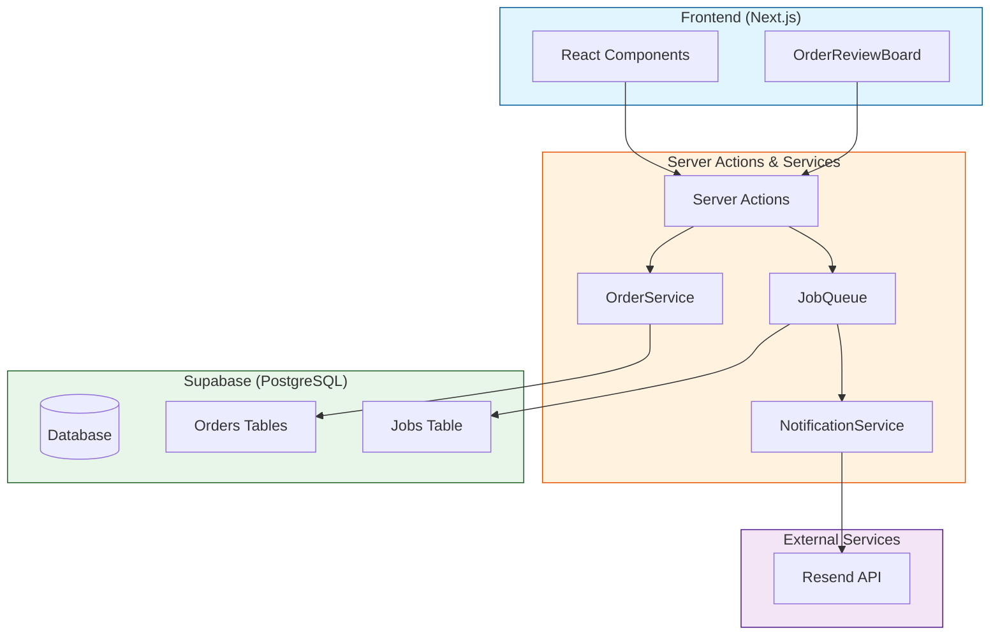
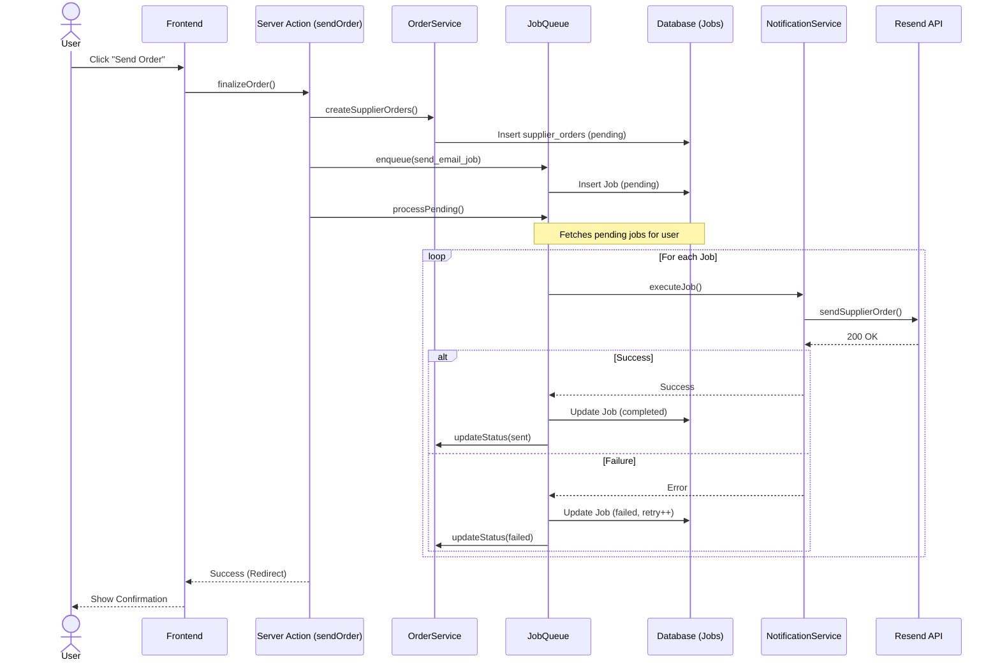
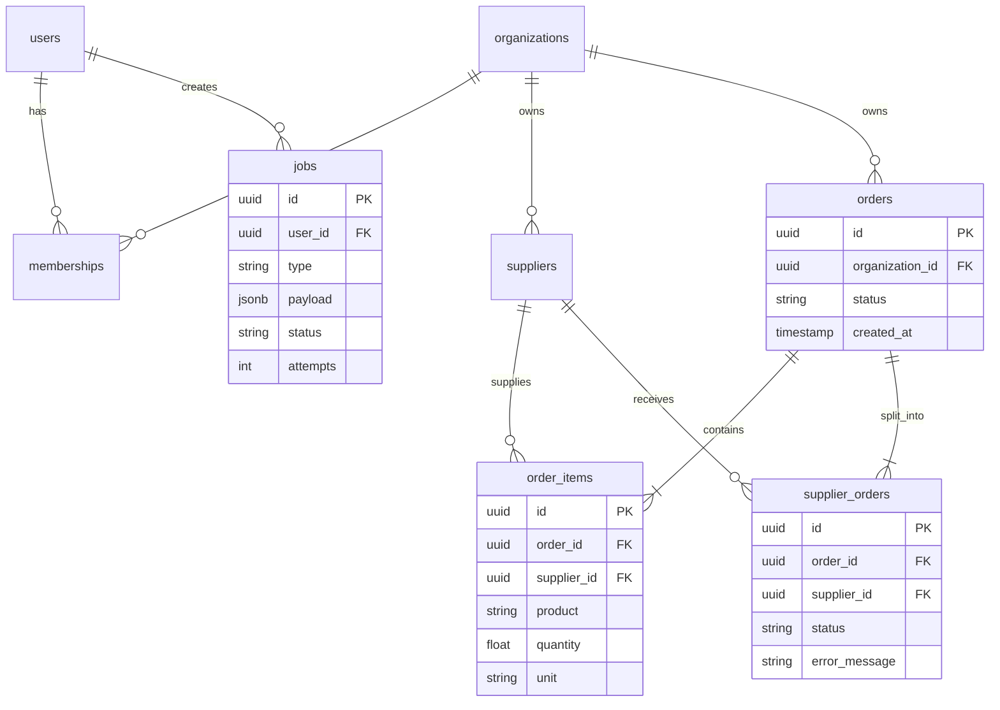

# System Architecture

This document describes the high-level architecture of the PedidosAI system, focusing on the Order Management flow.

## High-Level Architecture

The system follows a **Service-Oriented Architecture** pattern within a Next.js application. It separates concerns into:

1.  **Presentation Layer**: React Server/Client Components.
2.  **Action Layer**: Server Actions that handle user input and orchestration.
3.  **Service Layer**: Business logic and domain rules.
4.  **Data Layer**: Supabase (PostgreSQL) with Row Level Security (RLS).

## Order Processing Flow (Async Queue)

The order sending process is decoupled using an asynchronous job queue pattern to ensure reliability and responsiveness.

## Database Schema (ERD)

Key relationships for the Order Management module.

