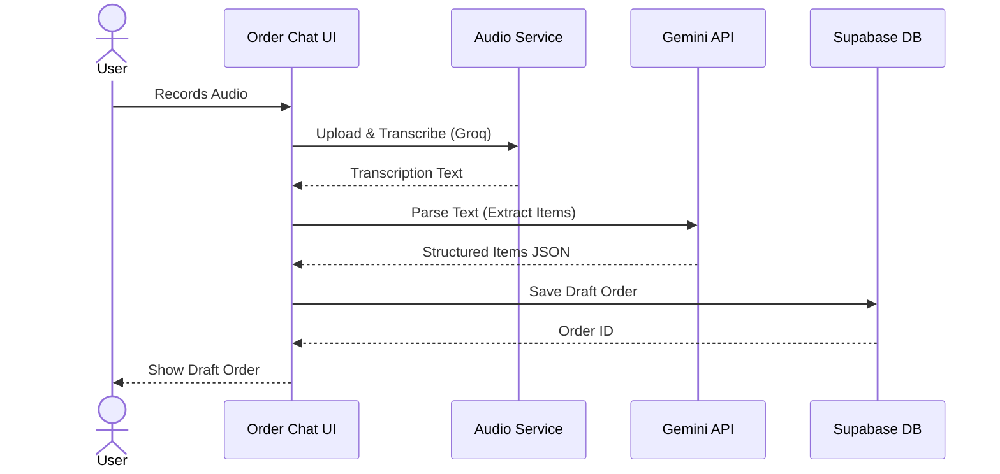
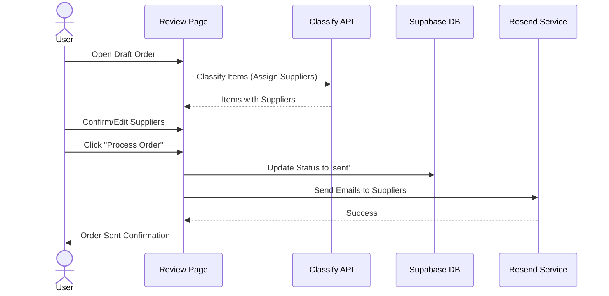
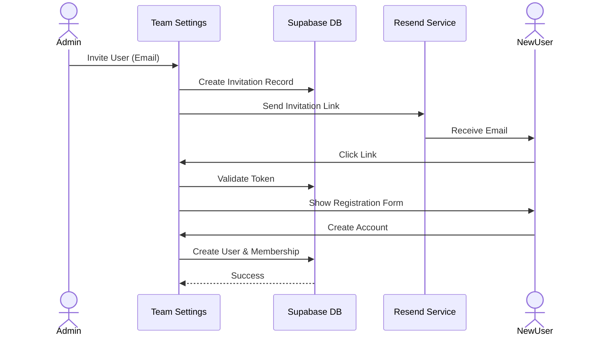

# User Flows

This document details the critical user journeys in **Supplai**.

## 1. Order Creation (Voice/Text)

The core value proposition is creating orders via natural language.

## 2. Order Review & Processing

After creation, the user reviews the order and sends it.

## 3. User Invitation Flow

How new users join an organization.

